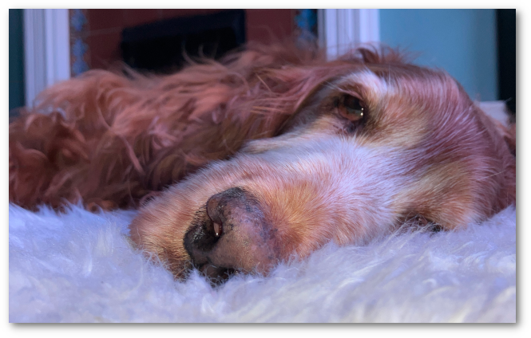
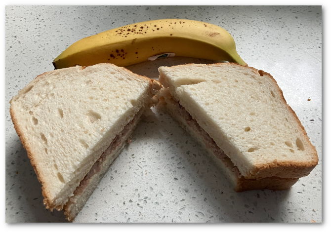

# Exam Prep for Certification type exams
These are what I've found works best for me when going to certification type exams.

## Location
Book the exam to take place at the certification centre and not in my home. This leaves me completely free from distractions which may happen at home such as parcels arriving, children/family and smelly dogs that bark.

## Clothing
Wear a t-shirt or pullover. The invigilators will ask you to roll down your sleeves if you wear a shirt with them rolled up. Apparently people like to cheat.

## Food
I eat before my exam. I like to have a tuna sandwich and a banana about 30 minutes prior to the start of the exam. 

Bananas and tuna are supposed to be good "brain foods". As a bear of little brain I like to imagine that eating this gives me maximum advantage.

## Exam Strategy
I like to race through and answer everything I know I know the answer to as fast as I can leaving blank the ones I don't know. As I see it this has the following advantages;

- See every question. Sometimes a later question will help you to work out the answer to an earlier question.
- Builds confidence.
- Leaves more time for the more difficult questions.

Dealing with questions where I've no clue is harder. I try to eliminate the impossible so if the question is:

Which animal has 4 legs and barks:

A. Cow
B. Duck
C. Dog
D. Wolf

Then I know I can get rid of both cow and duck. If I still don't know the answer then it's a 50 percent chance in the guess not a 25 percent chance.
